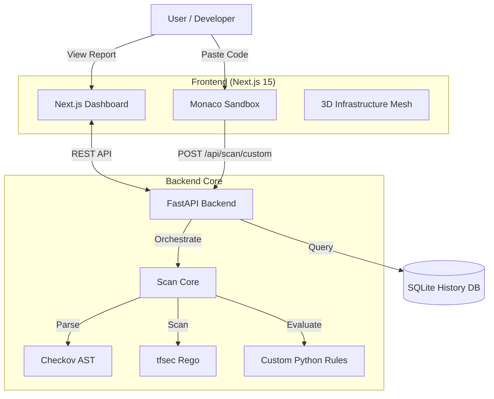

<div align="center">
  <h1 align="center">🛡️ IaC Compliance Scanner Platform</h1>
  <p align="center"><strong>Premium Infrastructure-as-Code Security Auditing & Visualization</strong></p>
  <p align="center">A high-fidelity DevSecOps platform for scanning, aggregating, and visualizing cloud security posture.</p>

  <p align="center">
    
    
    
    
    
  </p>

  <p align="center">
    <a href="#🚀-quick-start">🚀 Quick Start</a> • 
    <a href="#✨-key-features">✨ Features</a> • 
    <a href="#⚙️-architecture">⚙️ Architecture</a> • 
    <a href="#🛠️-custom-policies">📖 Custom Rules</a>
  </p>
</div>

---

## 🌟 Overview

The **IaC Compliance Scanner Platform** is a professional-grade security tool that orchestrates multiple scanning engines (**Checkov** & **tfsec**) to protect your cloud infrastructure. It features a stunning **Liquid Glass** interactive dashboard, real-time 3D infrastructure visualization, and a secure **Monaco-powered sandbox** for testing code on-the-fly.

| Component | Technology | Role |
| :--- | :--- | :--- |
| 🎨 **Frontend** | Next.js 15 + R3F | High-fidelity 3D interactive UI |
| ⚡ **Backend** | FastAPI | High-performance analysis orchestration |
| 🧠 **Engines** | Checkov + tfsec | Dual-engine SAST coverage |
| 🗄️ **Memory** | SQLite | Historical trend & compliance tracking |
| 🧪 **Sandbox** | Monaco Editor | Isolated user-input analysis environment |

---

## ✨ Key Features

*   ✅ **Dual-Engine SAST** - Simultaneous scanning with Checkov and tfsec for maximum detection.
*   ✅ **Interactive 3D Mesh** - Real-time WebGL visualization of infrastructure vulnerabilities.
*   ✅ **Liquid Glass UI** - Premium, modern aesthetic inspired by `oryzo.ai`.
*   ✅ **Secure Sandbox** - Paste Terraform code directly into a Monaco-powered IDE for instant evaluation.
*   ✅ **Historical Trends** - Track your compliance score over time with persistence in a local DB.
*   ✅ **Custom Python Policies** - Extend the platform with business-specific security logic.

---

## ⚙️ Architecture



---

## 🚀 Quick Start (The "Noob" Guide)

### 1. Prerequisites
*   **Python:** Install [Python 3.11+](https://www.python.org/downloads/).
*   **Node.js:** Install [Node.js 20+](https://nodejs.org/).
*   **tfsec:** Download the [tfsec binary](https://github.com/aquasecurity/tfsec/releases) and place it in the root directory as `tfsec.exe`.

### 2. Installation & Setup

```bash
# Clone the repository
git clone https://github.com/momonigithub/iac-compliance-scanner.git
cd iac-compliance-scanner

# Install Backend Dependencies
pip install -r requirements.txt

# Install Frontend Dependencies
cd frontend
npm install --legacy-peer-deps
```

### 3. Launch the Platform

Open two terminal windows:

**Terminal 1 (Backend):**
```bash
python -m uvicorn api.main:app --host 0.0.0.0 --port 8002
```

**Terminal 2 (Frontend):**
```bash
cd frontend
npm run dev
```

### 4. Usage
Access the dashboard at [**http://localhost:3000**](http://localhost:3000). 
*   Click **"Run Audit"** to scan the local repository.
*   Click **"Scan Custom Code"** to open the Monaco Sandbox.
*   Click **"Full Report"** to see the interactive compliance overview.

---

## 🛠️ Custom Policies

Extend the platform by adding Python rules in `policies/custom_policies/`:
*   **CKV_CUSTOM_1:** Mandatory Environment/Owner tagging.
*   **CKV_CUSTOM_2:** Enforces SecureTransport (HTTPS) for S3.

---

<div align="center">
  <p>Distributed under the MIT License.</p>
  <p><i>Made with ❤️ for Cloud Security Engineers.</i></p>
</div>
