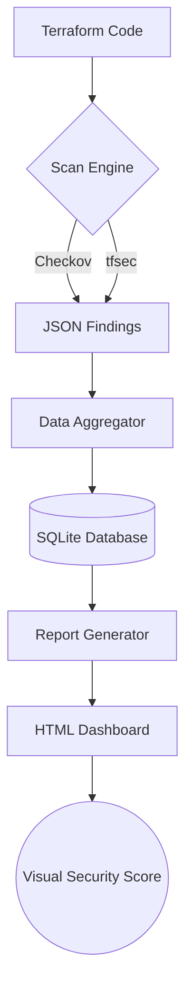

# 🛡️ IaC Compliance Scanner


> **The ultimate automated Infrastructure-as-Code (IaC) security auditing tool.** 
> Scan, Aggregate, and Visualize your cloud security posture in seconds.

---

## 📖 Table of Contents
- [Overview](#-overview)
- [How It Works](#-how-it-works)
- [Features](#-features)
- [Quick Start (The "Noob" Guide)](#-quick-start-the-noob-guide)
- [Project Structure](#-project-structure)
- [Custom Policies](#-custom-policies)
- [Screenshots](#-screenshots)
- [Troubleshooting](#-troubleshooting)

---

## 🌟 Overview

The **IaC Compliance Scanner** is a dual-engine security tool that combines the power of [Checkov](https://github.com/bridgecrewio/checkov) and [tfsec](https://github.com/aquasecurity/tfsec) to identify misconfigurations in your Terraform code. It doesn't just find bugs; it tracks them over time in a local database and generates a stunning HTML dashboard to visualize your progress.

### Why use this?
*   **Prevent Data Leaks:** Catches open S3 buckets and wildcard IAM policies before they reach production.
*   **Compliance Tracking:** See your security score improve over time with built-in trend graphs.
*   **Custom Rules:** Includes specialized Python-based policies for AWS tag enforcement and HTTPS enforcement.

---

## ⚙️ How It Works



---

## ✨ Features

- **Multi-Engine Scanning:** Uses both Checkov and tfsec for 2x the detection coverage.
- **Automated Dashboard:** Generates a beautiful HTML report with Chart.js visualization.
- **Historical Tracking:** Stores every scan in a local SQLite database (`scan_history.db`).
- **Custom Security Policies:** Ready-to-use Python policies in `policies/custom_policies/`.
- **Demo Mode:** Seed your history with a single command to see what a "perfect" trend looks like.

---

## 🚀 Quick Start (The "Noob" Guide)

Follow these steps exactly to get the scanner running on your machine.

### 1. Prerequisites
*   **Python:** Install [Python 3.9+](https://www.python.org/downloads/). (Check with `python --version`)
*   **Git:** Install [Git](https://git-scm.com/downloads).

### 2. Installation
Open your terminal (Command Prompt or PowerShell on Windows) and run:

```bash
# Clone the repository
git clone https://github.com/momonigithub/iac-compliance-scanner.git
cd iac-compliance-scanner

# Install the required Python packages
pip install -r requirements.txt
```

### 3. Setup Scanning Tools
*   **Checkov:** Installed automatically via `pip`.
*   **tfsec:** 
    *   **Windows:** [Download tfsec.exe](https://github.com/aquasecurity/tfsec/releases/latest/download/tfsec-windows-amd64.exe) and place it in the project root folder.
    *   **Linux/Mac:** `brew install tfsec` or `curl -s https://raw.githubusercontent.com/aquasecurity/tfsec/master/scripts/install_linux.sh | bash`

### 4. Running your first Scan
Perform the scan and generate the report with two simple commands:

```powershell
# 1. Run the scan (Scans terraform/secure and terraform/insecure)
python scanner/scan.py

# 2. Generate the visual dashboard
python scanner/report.py
```

### 5. View the Results
Go to the `reports/` folder and open the latest `.html` file in your favorite browser (Chrome/Edge/Firefox). **Boom! You have a security dashboard.**

---

## 📂 Project Structure

```text
.
├── db/                   # SQLite database (scan history)
├── policies/
│   └── custom_policies/  # Your custom Python security rules
├── reports/              # HTML dashboards and raw JSON results
├── scanner/
│   ├── scan.py           # The "Brain" (runs the tools)
│   ├── aggregate.py      # The "Memory" (database manager)
│   └── report.py         # The "Artist" (HTML generator)
├── terraform/            # Sample scan targets
│   ├── insecure/         # Intentionally vulnerable code
│   └── secure/           # Hardened, compliant code
├── Makefile              # Automation shortcuts
└── requirements.txt      # Python dependencies
```

---

## 🛠️ Custom Policies

We've included custom policies to show you how to extend the scanner:
1.  **CKV_CUSTOM_1:** Enforces `Environment`, `Owner`, and `Project` tags on all AWS resources.
2.  **CKV_CUSTOM_2:** Enforces HTTPS-only access for S3 buckets.

Edit these in `policies/custom_policies/` to fit your company's needs!

---

## ❓ Troubleshooting

**Q: "Command not found" for python?**
A: Try using `python3` instead of `python`.

**Q: No passed checks are showing up?**
A: Ensure your `terraform/secure/` directory contains valid `.tf` files. The scanner is very strict!

**Q: The dashboard is empty?**
A: You must run `python scanner/scan.py` at least once before running `python scanner/report.py`.

---

## 🤝 Contributing
Feel free to fork this project and submit Pull Requests! 

## 📜 License
Distributed under the MIT License. See `LICENSE` for more information.

---
*Made with ❤️ for Cloud Security Engineers.*
